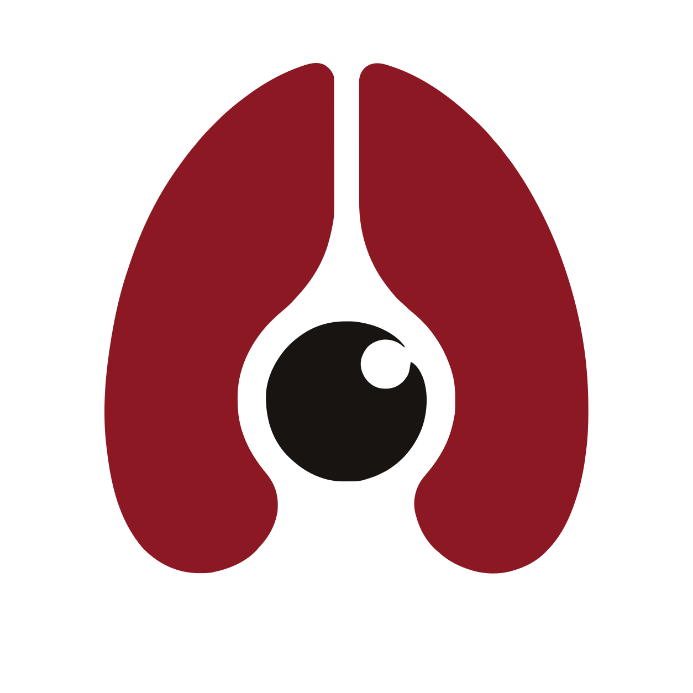

# AgarthaVision

<p align="center">
  
</p>

<p align="center">
  <strong>Clinical microscopy assistant for AI-supported Soil-Transmitted Helminth surveillance.</strong>
</p>

<p align="center">
  
  
  
  
  
  
  
</p>

## Overview

AgarthaVision is a mobile diagnostic-support and surveillance platform for fecal smear microscopy workflows. It helps medical technologists capture microscope frames, run AI-assisted parasite egg detection, verify results through a human-in-the-loop workflow, compute per-species Low Power Field (LPF) density ranges, and archive structured records for reporting and provincial coverage tracking.

The project is a decision-support and preprocessing tool. It does not replace qualified medical judgment, final diagnosis, or laboratory validation.

## Features

- **Patient-based records** — sessions and samples are organized under a patient, with PSGC barangay residence for surveillance aggregation.
- **AI-assisted capture** — one-shot CameraX capture with synchronous inference against a self-hosted FastAPI container; automatically falls back to manual capture on connection loss.
- **Human-in-the-loop verification** — every model detection is confirmed, corrected, or rejected by a medtech before it counts, with pre-filled answers, per-box species/stage questions, and an always-available manual "Add Egg" path.
- **LPF density reporting** — per-species Low Power Field density ranges (Direct Smear method) with a qualitative descriptor, replacing EPG/Kato-Katz.
- **PDF session reports** — generated on-device from local Room data and synced to Supabase.
- **My coverage dashboard** — an offline, province-level choropleth map of examined smears built from a bundled PSGC boundary dataset, no network call required.
- **Soft-delete safe** — a duplicate or rejected sample can be hidden from view without deleting its detections from the retraining corpus.

Phase 2 work — owned capture/inference hardware and a fuller self-hosted backend stack — is documented but intentionally deferred; see [`docs/features.md`](docs/features.md).

## Tech Stack

| Area | Technology |
| --- | --- |
| Language | Kotlin 2.2.10 |
| Platform | Android, min SDK 26, target SDK 36 |
| UI | Jetpack Compose, Material 3, Agartha components |
| Architecture | MVVM, Clean Architecture, Hilt |
| Local data | Room |
| Camera | CameraX |
| Networking | Retrofit, OkHttp, Ktor client |
| Cloud data | Supabase Auth, PostgREST, Storage |
| Inference | FastAPI container with custom Ultralytics model weights |
| Tooling | Gradle Kotlin DSL, Bun scripts, ktlint, detekt, commitlint |

See [`docs/stack.md`](docs/stack.md) for exact library versions read from `gradle/libs.versions.toml`.

## Architecture

AgarthaVision uses MVVM with Clean Architecture boundaries inside a single Android application module.

```text
app/
  src/main/java/com/agarthavision/
    core/       Shared platform services, DI, database, networking, utilities
    domain/     Pure Kotlin models, repositories, and use cases
    data/       Room, Supabase, Retrofit, mappers, and repository implementations
    ui/         Jetpack Compose screens, ViewModels, navigation, and theme

supabase/
  migrations/
    0001_init.sql   Consolidated Postgres schema and RLS for the current project
    legacy-dev/     Archived pre-patient migration history (superseded)

inference/
  Dockerfile   Self-hosted FastAPI inference container
  server.py    GET /health and POST /infer
  weights/     Model weights used by the inference image

tools/
  geo/    Offline province/town boundary asset pipeline (PSGC-keyed)
  psgc/   Offline barangay reference database build
```

Key rules — the full set of thirteen architectural/clinical/process constraints (with enforcement points) lives in [`docs/constraints.md`](docs/constraints.md). Short version:

- ViewModels call domain use cases, not data-layer classes directly.
- Domain models remain pure Kotlin and do not import Android APIs.
- Room entities and remote DTOs are mapped into domain models.
- Supabase is the Auth, Postgres, and Storage provider.
- The inference service is stateless: it receives a frame, returns predictions, and does not persist images.
- No model output counts as a finding until a human confirms it.

## Getting Started

### Prerequisites

- JDK 21
- Android Studio or IntelliJ IDEA with Android SDK 36
- Bun
- Git
- Access to the team Supabase and inference credentials

### Setup

1. Clone the repository.

   ```bash
   git clone https://github.com/Joryuoo/AgarthaVision.git
   cd AgarthaVision
   ```

2. Install project tooling and Git hooks.

   ```bash
   bun install
   ```

3. Create your local secrets file.

   ```bash
   cp local.properties.example local.properties
   ```

4. Fill `local.properties` with the Supabase and inference values shared by the team. Never commit real keys.

5. Open the project in Android Studio and let Gradle sync, or verify from the command line:

   ```bash
   ./gradlew assembleDebug
   ```

On Windows PowerShell, use `.\gradlew.bat assembleDebug` if the shell does not resolve `./gradlew`.

### Common Commands

| Command | Purpose |
| --- | --- |
| `bun run build` | Build the debug APK |
| `bun run compile` | Compile debug Kotlin |
| `bun run test` | Run debug unit tests |
| `bun run lint` | Run ktlint and detekt |
| `bun run lint:fix` | Apply ktlint formatting |
| `bun run install:device` | Install debug build on a connected device |
| `bun run clean` | Clean Gradle outputs |

See [`docs/commands.md`](docs/commands.md) for the full command reference, including Gradle-direct invocations and the inference container.

### Backend and Data

Supabase migrations live in `supabase/migrations/`. `0001_init.sql` is the consolidated, current schema for the `agarthavision` project (sessions, samples, detections, predictions, patients, storage RLS, and persisted session reports), applied by hand through the Supabase dashboard. Pre-patient migration history is archived under `supabase/migrations/legacy-dev/` as a record of the earlier dev/prod projects — do not implement against it.

The inference container lives in `inference/`. It exposes:

- `GET /health` for connectivity checks.
- `POST /infer` for frame inference using bearer-token authentication.

The mobile app persists verified samples locally with Room, uploads images to Supabase Storage, and writes sample/detection/report metadata to Supabase Postgres when sync succeeds.

## Documentation

Start at [`SESSION_INIT.md`](SESSION_INIT.md). It is the single entry point for both contributors and automated agents: what the project is, the repo/ClickUp boundary, a routing table from situation to file, and the thirteen project constraints by name.

Everything it routes to lives under `docs/`:

- `docs/constraints.md` and `docs/non-negotiables.md` - the rules, with their enforcement points.
- `docs/stack.md` and `docs/commands.md` - versions and everything runnable.
- `docs/features.md`, `docs/CHANGELOG.md`, `docs/file-tree.md` - what ships, what changed, where things live.
- `docs/map/` - object cards, process cards, and the change-impact index.
- `schema.ts` - ground-truth data model for Supabase, Room, domain enums, Storage, and relationships.

*(Sprint backlog items and tasks are managed in ClickUp, not this repo.)*

Documentation here is as-built and cited to `path:line`. Where a document and the code disagree, the code wins - fix the document in the same change.

## Contributing

See [`CONTRIBUTING.md`](CONTRIBUTING.md) for the development workflow, branch/commit conventions, and PR process.

## License

This repository does not yet include a license. Until one is added, all rights are reserved by the authors — do not reuse or redistribute this code without permission.

## Contributors

- John Winston Tabada
- Jhon Ryan Ledon
- Josh Mark Piodos
- Ben Joseph Escolano
- Joseph Victor Novabos

## Disclaimer

AgarthaVision is built for academic and clinical workflow support. It is not a standalone diagnostic authority and must be used under the review of qualified medical personnel.
