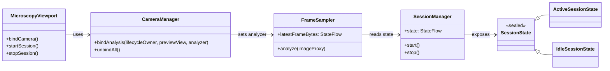

# 1.1 Live Image Acquisition

```mermaid
classDiagram
direction LR

class MicroscopyViewport {
  +bindCamera()
  +startSession()
  +stopSession()
}

class CameraManager {
  +bindAnalysis(lifecycleOwner, previewView, analyzer)
  +unbindAll()
}

class FrameSampler {
  +latestFrameBytes: StateFlow
  +analyze(imageProxy)
}

class SessionManager {
  +state: StateFlow
  +start()
  +stop()
}

class SessionState {
  <<sealed>>
}
class ActiveSessionState
class IdleSessionState

SessionState <|-- ActiveSessionState
SessionState <|-- IdleSessionState

MicroscopyViewport --> CameraManager : uses
CameraManager --> FrameSampler : sets analyzer
FrameSampler --> SessionManager : reads state
SessionManager --> SessionState : exposes
```
