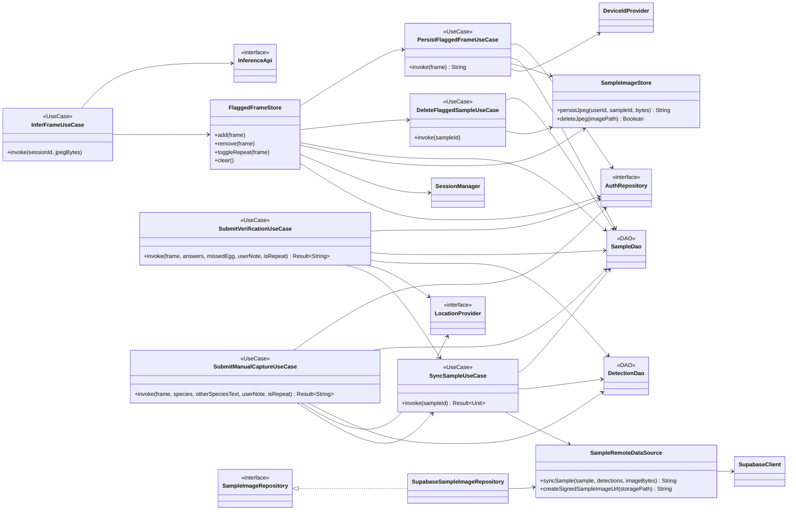

# 1.2 Image Payload Transmission

```mermaid
classDiagram
direction LR

class InferenceApi <<interface>>
class InferFrameUseCase <<UseCase>> {
  +invoke(sessionId, jpegBytes)
}
InferFrameUseCase --> InferenceApi
InferFrameUseCase --> FlaggedFrameStore

class FlaggedFrameStore {
  +add(frame)
  +remove(frame)
  +toggleRepeat(frame)
  +clear()
}
FlaggedFrameStore --> PersistFlaggedFrameUseCase
FlaggedFrameStore --> DeleteFlaggedSampleUseCase
FlaggedFrameStore --> SampleDao
FlaggedFrameStore --> SampleImageStore
FlaggedFrameStore --> SessionManager
FlaggedFrameStore --> AuthRepository

class PersistFlaggedFrameUseCase <<UseCase>> {
  +invoke(frame) String
}
PersistFlaggedFrameUseCase --> AuthRepository
PersistFlaggedFrameUseCase --> SampleDao
PersistFlaggedFrameUseCase --> SampleImageStore
PersistFlaggedFrameUseCase --> DeviceIdProvider

class DeleteFlaggedSampleUseCase <<UseCase>> {
  +invoke(sampleId)
}
DeleteFlaggedSampleUseCase --> SampleDao
DeleteFlaggedSampleUseCase --> SampleImageStore

class SubmitVerificationUseCase <<UseCase>> {
  +invoke(frame, answers, missedEgg, userNote, isRepeat) Result~String~
}
SubmitVerificationUseCase --> AuthRepository
SubmitVerificationUseCase --> SampleDao
SubmitVerificationUseCase --> DetectionDao
SubmitVerificationUseCase --> LocationProvider
SubmitVerificationUseCase --> SyncSampleUseCase

class SubmitManualCaptureUseCase <<UseCase>> {
  +invoke(frame, species, otherSpeciesText, userNote, isRepeat) Result~String~
}
SubmitManualCaptureUseCase --> AuthRepository
SubmitManualCaptureUseCase --> SampleDao
SubmitManualCaptureUseCase --> DetectionDao
SubmitManualCaptureUseCase --> LocationProvider
SubmitManualCaptureUseCase --> SyncSampleUseCase

class SyncSampleUseCase <<UseCase>> {
  +invoke(sampleId) Result~Unit~
}
SyncSampleUseCase --> SampleDao
SyncSampleUseCase --> DetectionDao
SyncSampleUseCase --> SampleRemoteDataSource

class SampleRemoteDataSource {
  +syncSample(sample, detections, imageBytes) String
  +createSignedSampleImageUrl(storagePath) String
}
SampleRemoteDataSource --> SupabaseClient

class SampleImageRepository <<interface>>
class SupabaseSampleImageRepository
SampleImageRepository <|.. SupabaseSampleImageRepository
SupabaseSampleImageRepository --> SampleRemoteDataSource

class SampleImageStore {
  +persistJpeg(userId, sampleId, bytes) String
  +deleteJpeg(imagePath) Boolean
}

class SampleDao <<DAO>>
class DetectionDao <<DAO>>
class SessionManager
class AuthRepository <<interface>>
class LocationProvider <<interface>>
class DeviceIdProvider
class SupabaseClient
```

