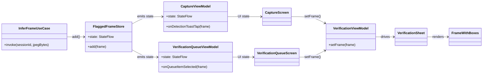

# 2.1 Diagnostic Result Rendering

```mermaid
classDiagram
direction LR

class InferFrameUseCase {
  +invoke(sessionId, jpegBytes)
}

class FlaggedFrameStore {
  +state: StateFlow
  +add(frame)
}

class CaptureViewModel {
  +state: StateFlow
  +onDetectionToastTap(frame)
}

class VerificationQueueViewModel {
  +state: StateFlow
  +onQueueItemSelected(frame)
}

class VerificationViewModel {
  +setFrame(frame)
}

class CaptureScreen
class VerificationQueueScreen
class VerificationSheet
class FrameWithBoxes

InferFrameUseCase --> FlaggedFrameStore : add()
FlaggedFrameStore --> CaptureViewModel : emits state
FlaggedFrameStore --> VerificationQueueViewModel : emits state
CaptureViewModel --> CaptureScreen : UI state
VerificationQueueViewModel --> VerificationQueueScreen : UI state
CaptureScreen --> VerificationViewModel : setFrame()
VerificationQueueScreen --> VerificationViewModel : setFrame()
VerificationViewModel --> VerificationSheet : drives
VerificationSheet --> FrameWithBoxes : renders
```
