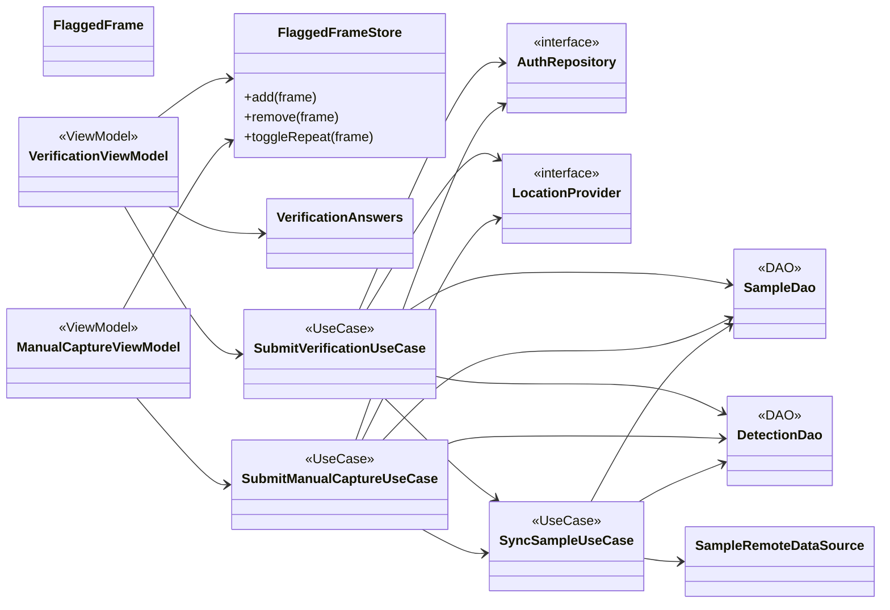

# 2.2 Human-in-the-Loop Validation

```mermaid
classDiagram
direction LR

class FlaggedFrame
class FlaggedFrameStore {
  +add(frame)
  +remove(frame)
  +toggleRepeat(frame)
}

class VerificationAnswers

class VerificationViewModel <<ViewModel>>
VerificationViewModel --> FlaggedFrameStore
VerificationViewModel --> SubmitVerificationUseCase
VerificationViewModel --> VerificationAnswers

class ManualCaptureViewModel <<ViewModel>>
ManualCaptureViewModel --> FlaggedFrameStore
ManualCaptureViewModel --> SubmitManualCaptureUseCase

class SubmitVerificationUseCase <<UseCase>>
SubmitVerificationUseCase --> AuthRepository
SubmitVerificationUseCase --> SampleDao
SubmitVerificationUseCase --> DetectionDao
SubmitVerificationUseCase --> LocationProvider
SubmitVerificationUseCase --> SyncSampleUseCase

class SubmitManualCaptureUseCase <<UseCase>>
SubmitManualCaptureUseCase --> AuthRepository
SubmitManualCaptureUseCase --> SampleDao
SubmitManualCaptureUseCase --> DetectionDao
SubmitManualCaptureUseCase --> LocationProvider
SubmitManualCaptureUseCase --> SyncSampleUseCase

class SyncSampleUseCase <<UseCase>>
SyncSampleUseCase --> SampleRemoteDataSource
SyncSampleUseCase --> SampleDao
SyncSampleUseCase --> DetectionDao

class SampleRemoteDataSource

class AuthRepository <<interface>>
class LocationProvider <<interface>>
class SampleDao <<DAO>>
class DetectionDao <<DAO>>
```

