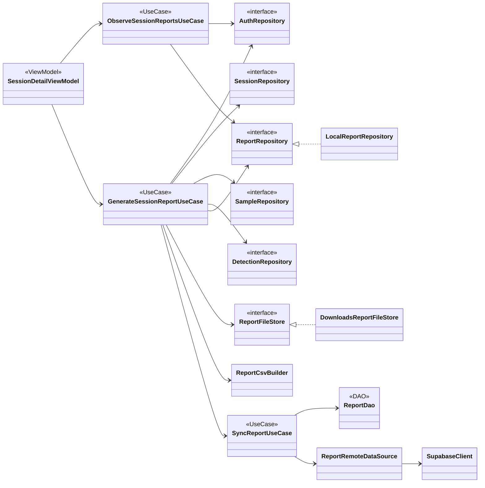

# 3.1 Session-Based User Report Generation

```mermaid
classDiagram
direction LR

class SessionDetailViewModel <<ViewModel>>
SessionDetailViewModel --> ObserveSessionReportsUseCase
SessionDetailViewModel --> GenerateSessionReportUseCase

class ObserveSessionReportsUseCase <<UseCase>>
ObserveSessionReportsUseCase --> AuthRepository
ObserveSessionReportsUseCase --> ReportRepository

class GenerateSessionReportUseCase <<UseCase>>
GenerateSessionReportUseCase --> AuthRepository
GenerateSessionReportUseCase --> SessionRepository
GenerateSessionReportUseCase --> SampleRepository
GenerateSessionReportUseCase --> DetectionRepository
GenerateSessionReportUseCase --> ReportRepository
GenerateSessionReportUseCase --> ReportFileStore
GenerateSessionReportUseCase --> ReportCsvBuilder
GenerateSessionReportUseCase --> SyncReportUseCase

class ReportCsvBuilder

class ReportFileStore <<interface>>
class DownloadsReportFileStore
ReportFileStore <|.. DownloadsReportFileStore

class ReportRepository <<interface>>
class LocalReportRepository
ReportRepository <|.. LocalReportRepository

class SyncReportUseCase <<UseCase>>
SyncReportUseCase --> ReportDao
SyncReportUseCase --> ReportRemoteDataSource

class ReportRemoteDataSource
ReportRemoteDataSource --> SupabaseClient

class AuthRepository <<interface>>
class SessionRepository <<interface>>
class SampleRepository <<interface>>
class DetectionRepository <<interface>>
class ReportDao <<DAO>>
class SupabaseClient
```

