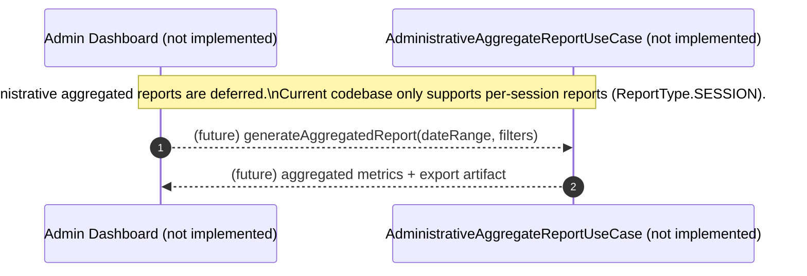
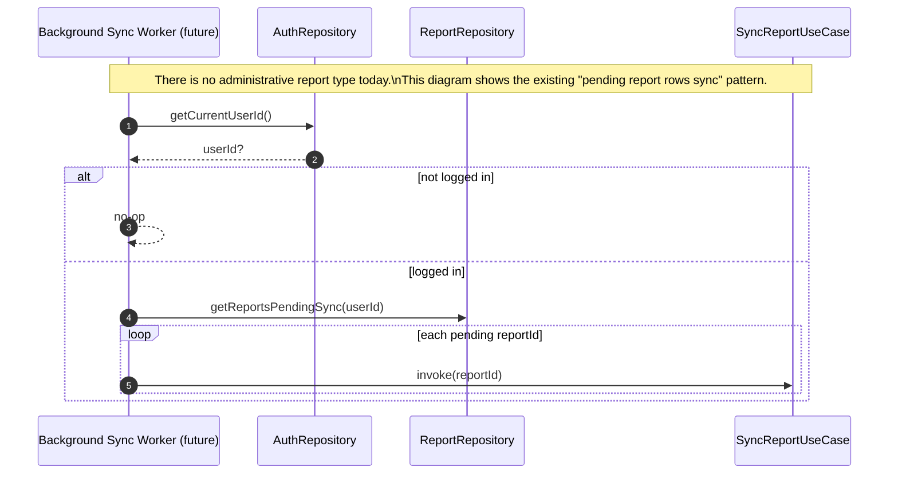

# 3.2 Administrative Aggregated Report Generation

```mermaid
sequenceDiagram
autonumber

participant AdminUI as Admin Dashboard (not implemented)
participant AdminAgg as AdministrativeAggregateReportUseCase (not implemented)

note over AdminUI,AdminAgg: Administrative aggregated reports are deferred.\nCurrent codebase only supports per-session reports (ReportType.SESSION).

AdminUI-->>AdminAgg: (future) generateAggregatedReport(dateRange, filters)
AdminAgg-->>AdminUI: (future) aggregated metrics + export artifact
```

```mermaid
sequenceDiagram
autonumber

participant BG as Background Sync Worker (future)
participant AUTH as AuthRepository
participant RRepo as ReportRepository
participant Sync as SyncReportUseCase

note over BG,Sync: There is no administrative report type today.\nThis diagram shows the existing "pending report rows sync" pattern.

BG->>AUTH: getCurrentUserId()
AUTH-->>BG: userId?
alt not logged in
  BG-->>BG: no-op
else logged in
  BG->>RRepo: getReportsPendingSync(userId)
  loop each pending reportId
    BG->>Sync: invoke(reportId)
  end
end
```

